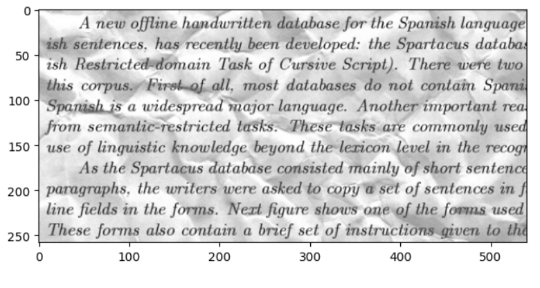

# Denoising Dirty Documents using Convolutional Autoencoder

This project aims to clean and restore noisy scanned document images using a Convolutional Autoencoder built with TensorFlow and Keras. The dataset used is from the Kaggle competition [Denoising Dirty Documents](https://www.kaggle.com/competitions/denoising-dirty-documents).

---

## 📁 Project Structure

```
denoising_dirty_documents/
├── train/
│   ├── train/              # Noisy training images
│   └── train_cleaned/      # Cleaned training images (ground truth)
└── test/                   # Noisy test images to denoise
```

---

## 🧠 Model Architecture

A simple Convolutional Autoencoder was used:

- **Encoder:**
  - Conv2D → BatchNormalization → MaxPooling
- **Decoder:**
  - Conv2D → UpSampling → Conv2D with sigmoid activation

---

## 🛠️ Setup Instructions

1. **Install dependencies**:
   ```bash
   pip install -r requirements.txt
   ```

2. **Kaggle API Setup**:
   - Upload your `kaggle.json` (Kaggle API key) to the working directory.
   - This script will automatically place it in the right location:
     ```python
     import shutil, os
     os.makedirs("/root/.kaggle", exist_ok=True)
     shutil.move("kaggle.json", "/root/.kaggle/kaggle.json")
     os.chmod("/root/.kaggle/kaggle.json", 600)
     ```

3. **Download & Unzip Dataset**:
   ```bash
   kaggle competitions download -c denoising-dirty-documents
   unzip denoising-dirty-documents.zip -d denoising_dirty_documents
   ```

---

## 🖼️ Data Preprocessing

- Images are loaded in grayscale format and resized to **258×540** (based on min height found in training images).
- Pixel values are normalized between 0 and 1.
- Each image is reshaped to have a single channel.

---

## 🧪 Training

- Data is split into training and validation sets.
- Trained for 30 epochs with a batch size of 8.
- Loss Function: `Mean Squared Error`
- Metric: `Root Mean Squared Error`

---

## ✅ Sample Output

| Noisy Image | Denoised Image |
|-------------|----------------|
|  |  |

*(Replace the placeholders with actual examples if needed)*

---

## 🔮 Predictions

Predictions on test images are displayed using `matplotlib`. Denoised outputs are shown side-by-side with original noisy inputs.

---

## 📦 Dependencies

- Python 3.x
- TensorFlow
- Keras
- OpenCV
- NumPy
- Pandas
- Matplotlib
- Scikit-learn
- PIL

---

## 📌 Notes

- Ensure all images are preprocessed to the same shape before training.
- Autoencoder models can be further enhanced by adding more layers or using skip connections (e.g., UNet).
- Performance may vary depending on image noise levels.

---

## 🏁 Future Improvements

- Implement a deeper model (e.g., U-Net).
- Train with data augmentation.
- Evaluate performance using additional metrics (SSIM, PSNR).

---

## ✍️ Author

- Developed as part of a denoising project using Keras & OpenCV.
